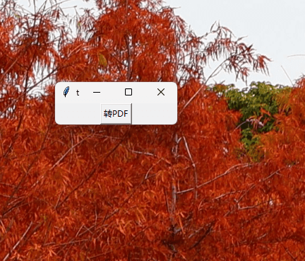

# PPT2Fig


PPT2Fig 是一个简单实用的工具，可以快速将 **当前打开的PowerPoint的当前页面** 导出为矢量PDF文件，并自动裁剪白边。非常适合科研人员在使用PPT作图时，修改PPT后快速导出PDF插入到论文中。

PPT2Fig is a simple and practical tool that can quickly export the **current page of the currently opened PowerPoint** to a vector PDF file and automatically crop the white edge. It is very useful for scientific researchers to quickly export PDF after modifying PPT and inserting it into the paper.


## 功能特点

- 一键导出当前 PPT 页面为 PDF
- 自动检测 PowerPoint 运行状态
- 简洁的界面设计，默认一键操作
- 可展开的高级裁剪设置：
  - 快速预设：紧密裁剪、小白边、中白边、保留原边距
  - 可调整保留原始边距的百分比
  - 可设置额外的白边大小
  - 可调整背景检测阈值
  - 支持统一裁剪和统一页面大小选项
- 智能记忆上次保存路径
- 始终置顶显示，方便操作


## 安装方法

1. 直接下载[Releases](https://github.com/elliottzheng/ppt2fig/releases)中的exe文件，双击即可运行

2. 如果你有python环境，可以使用pip安装

```bash
pip install ppt2fig
```
然后运行
```bash
ppt2fig
```
或者
```bash
python -m ppt2fig
```

## 使用方法
程序运行后会出现一个简洁的界面：



### 基本使用（适合大多数用户）：

1. 点击"转PDF"按钮（请确保点击时PowerPoint是打开的）
2. 选择保存位置并点击"保存"，则**当前活跃的PPT页面**会导出为PDF文件并自动裁剪白边
3. 默认保存路径为当前活跃PPT文件所在目录

### 高级设置（需要精细控制时）：

点击"▼ 显示高级设置"展开详细参数控制：

#### 快速设置预设：
- **紧密裁剪**: 完全去除白边
- **小白边**: 保留约1mm白边  
- **中白边**: 保留约2mm白边
- **保留原边距**: 保留10%的原始边距

#### 详细参数设置：

1. **保留原始边距(%)**: 设置保留原PDF边距的百分比
   - 0% = 完全去除边距（紧密裁剪）
   - 10% = 保留10%的原始边距
   - 适合对有一定边距的PDF进行微调

2. **额外白边(bp)**: 在裁剪后额外增加的白边大小
   - 单位为 bp (big points)，1bp ≈ 0.35mm
   - 适合需要为图片添加统一白边的场景

3. **检测阈值**: 背景检测的阈值设置 (0-255)
   - 默认值191适合大多数情况
   - 值越小检测越严格，适合灰色背景
   - 值越大检测越宽松

4. **裁剪选项**:
   - **统一裁剪**: 所有页面使用相同的裁剪量
   - **统一页面大小**: 所有页面设为相同尺寸


## 系统要求

- Windows 操作系统
- Microsoft PowerPoint
- Python 3.8+

## 依赖项（安装时自动安装）

- comtypes: 用于与PowerPoint交互    
- pdfCropMargins: 裁剪PDF白边
- tkinter: python自带


## 注意事项

- 使用前请确保已经打开 PowerPoint
- 确保当前 PowerPoint 中有打开的演示文稿
- 导出过程中请勿关闭 PowerPoint


## 编译指南

1. 下载源码
2. 创建一个环境，只安装本项目依赖和pyinstaller
3. 参考[配置upx](https://blog.csdn.net/JiuShu110/article/details/132625538)配置upx，用于压缩exe文件
4. 编译
```cmd
pyinstaller -F -w -n ppt2fig --optimize=2 ppt2fig/main.py 
```

## 许可证

[MIT License](LICENSE)