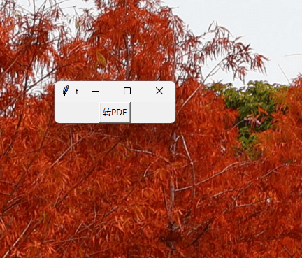

# PPT2Fig

PPT2Fig 是一个用于将 PPT 页面导出为 PDF 并自动裁剪白边的工具。

- Windows 下保留原有 GUI，可直接导出当前打开的 PowerPoint 当前页
- 新增跨平台 CLI，可直接指定 `pptx` 文件路径和页码
- CLI 不依赖 Microsoft PowerPoint，可自动检测本机候选后端

PPT2Fig exports PowerPoint slides to PDF and can automatically crop white margins.


## 功能特点

- Windows GUI 一键导出当前 PowerPoint 当前页为 PDF
- 跨平台 CLI，支持指定 PPT/PPTX/ODP 文件和页码
- CLI 不依赖 Microsoft PowerPoint
- 自动检测系统中的候选后端
- 自动裁剪白边
- 可展开的高级裁剪设置：
  - 快速预设：紧密裁剪、小白边、中白边、保留原边距
  - 可调整保留原始边距的百分比
  - 可设置额外的白边大小
  - 可调整背景检测阈值
  - 支持统一裁剪和统一页面大小选项
- Windows GUI 智能记忆上次保存路径
- Windows GUI 始终置顶显示，方便操作


## 安装方法

1. 直接下载[Releases](https://github.com/elliottzheng/ppt2fig/releases)中的exe文件，双击即可运行

2. 如果你有python环境，可以使用pip安装

```bash
pip install ppt2fig
```
然后运行
```bash
ppt2fig
```
或者
```bash
python -m ppt2fig
```

如果你要在 Linux/macOS 上使用 CLI，推荐安装 LibreOffice，并确保命令行里能找到 `soffice` 或 `libreoffice`。

## 使用方法

### Windows GUI

程序运行后会出现一个简洁的界面：



### 基本使用（适合大多数用户）：

1. 点击"转PDF"按钮（请确保点击时PowerPoint是打开的）
2. 选择保存位置并点击"保存"，则**当前活跃的PPT页面**会导出为PDF文件并自动裁剪白边
3. 默认保存路径为当前活跃PPT文件所在目录

### 高级设置（需要精细控制时）：

点击"▼ 显示高级设置"展开详细参数控制：

#### 快速设置预设：
- **紧密裁剪**: 完全去除白边
- **小白边**: 保留约1mm白边  
- **中白边**: 保留约2mm白边
- **保留原边距**: 保留10%的原始边距

#### 详细参数设置：

1. **保留原始边距(%)**: 设置保留原PDF边距的百分比
   - 0% = 完全去除边距（紧密裁剪）
   - 10% = 保留10%的原始边距
   - 适合对有一定边距的PDF进行微调

2. **额外白边(bp)**: 在裁剪后额外增加的白边大小
   - 单位为 bp (big points)，1bp ≈ 0.35mm
   - 适合需要为图片添加统一白边的场景

3. **检测阈值**: 背景检测的阈值设置 (0-255)
   - 默认值191适合大多数情况
   - 值越小检测越严格，适合灰色背景
   - 值越大检测越宽松

4. **裁剪选项**:
   - **统一裁剪**: 所有页面使用相同的裁剪量
   - **统一页面大小**: 所有页面设为相同尺寸

### CLI

CLI 适用于 Linux、macOS、Windows，不依赖 PowerPoint。
程序会自动检测本机候选后端。
当前已实现的自动导出后端是：

- `LibreOffice`: Windows / Linux / macOS
- `PowerPoint`: Windows / macOS
- `WPS`: Windows

`--list-backends` 会尽量按当前平台列出已检测到的候选程序，即使该平台暂时还没有实现对应的自动导出驱动。
在 `auto` 模式下，默认优先级是 `LibreOffice > WPS > PowerPoint`。

基本示例：

```bash
ppt2fig ./demo.pptx --pages 3
```

导出多个页码：

```bash
ppt2fig ./demo.pptx --pages 1,3,5-7 -o ./figure.pdf
```

关闭裁剪：

```bash
ppt2fig ./demo.pptx --pages 2 --no-crop
```

指定 LibreOffice 可执行文件：

```bash
ppt2fig ./demo.pptx --pages 4 --office-bin /usr/bin/soffice
```

强制使用 PowerPoint 后端：

```bash
ppt2fig ./demo.pptx --pages 2 --backend powerpoint
```

强制使用 WPS 后端：

```bash
ppt2fig ./demo.pptx --pages 2 --backend wps
```

使用 PowerPoint 的打印质量导出：

```bash
ppt2fig ./demo.pptx --pages 2 --backend powerpoint --powerpoint-intent print
```

查看当前机器检测到的候选后端：

```bash
ppt2fig --list-backends
```

常用参数：

- `--pages`: 必填，支持 `1,3,5-7`
- `--output`: 输出 PDF 路径
- `--office-bin`: 指定 `soffice` 或 `libreoffice`
- `--backend`: 选择 `auto`、`libreoffice`、`powerpoint` 或 `wps`
- `--powerpoint-intent`: PowerPoint 后端使用 `print` 或 `screen`
- `--bitmap-missing-fonts`: 字体无法嵌入时将文字转为位图
- `--list-backends`: 查看当前检测到的候选后端
- `--no-crop`: 不裁剪白边
- `--percent-retain`: 保留原始边距百分比
- `--margin-size`: 额外白边，单位 bp
- `--threshold`: 背景检测阈值
- `--no-uniform`: 禁用统一裁剪
- `--no-same-size`: 禁用统一页面大小


## 系统要求

- GUI:
  - Windows
  - Microsoft PowerPoint
- CLI:
  - Windows / Linux / macOS
  - 推荐 LibreOffice
- Python 3.8+

## 依赖项（安装时自动安装）

- comtypes: Windows GUI 下用于与PowerPoint交互
- pdfCropMargins: 裁剪PDF白边
- pypdf: 从导出的整份 PDF 中提取指定页
- tkinter: Python 自带，仅 GUI 使用


## 注意事项

- GUI 使用前请确保已经打开 PowerPoint
- GUI 依赖当前活动演示文稿
- CLI 会先自动检测候选后端；不同平台上的自动导出支持范围不同
- `--list-backends` 中的 `detected` 表示发现了候选程序，但当前平台未必已经实现自动导出
- CLI 当前通过导出整份 PDF 后再抽取指定页，因此页码以导出后的 PDF 页序为准
- 如果系统里没有可用的 LibreOffice 兼容后端，请安装 LibreOffice 或用 `--office-bin` 显式指定路径


## 编译指南

1. 下载源码
2. 创建一个环境，只安装本项目依赖和pyinstaller
3. 参考[配置upx](https://blog.csdn.net/JiuShu110/article/details/132625538)配置upx，用于压缩exe文件
4. 编译
```cmd
pyinstaller -F -w -n ppt2fig --optimize=2 ppt2fig/main.py 
```

## 许可证

[MIT License](LICENSE)
